<p align="center">
  
</p>

# omp-greppy

[greppy](https://github.com/metric-space-ai/greppy) code-graph tools for
[Oh My Pi](https://github.com/can1357/oh-my-pi) (omp) and pi. The agent gets
exact answers to structural questions (where a symbol is defined, who calls it,
how far a change reaches, how A reaches B) plus local semantic search. Each
answer takes one tool call and no model spend.

## What it adds

**Tools.** Each tool runs one greppy command in the session's repository.

| Tool | greppy command | Use it for |
|---|---|---|
| `gsymbol` | `search-symbol` | Where a symbol is defined |
| `gcallers` | `who-calls` | Who calls or uses a symbol (several at once) |
| `gcallees` | `callees` | What a symbol uses |
| `gimpact` | `impact` | Transitive blast radius (`direction: outgoing` for what it reaches) |
| `gchain` | `path --from --to` | Call chains from A to B |
| `gbrief` | `brief` | One-sentence summary and step sketch |
| `gread` | `read` / `read-smart` | Source of symbols by name |
| `gsearch` | `search` | Concept-to-code search on the local embedding index |
| `gpattern` | `search-pattern` | Regex or literal matches with their enclosing definition |

All tools are read-only (`approval: read`) and cap greppy's stdout at 16 KB by
default (`maxBytes`). Exit code 75 ("index not ready") becomes guidance
instead of an error. `gsearch` then points the model at `ffjfind`.

**Per-prompt note.** A `<greppy-tools>` block is appended to the last user
message on every request, the same way omp-find adds `<find-tools>`. It only
appears when a greppy binary is found and the cwd is inside a git repository.
When the repository has no index yet, the note says so rather than promising a
graph. The index check is cached per repository and refreshed in the
background, so the note never delays a prompt.

**Commands.**
- `/greppy-status` shows the binary, the CUDA runtime (Windows), and the index
  state and progress.
- `/greppy-index` builds or refreshes the index in the background and notifies
  when it finishes.

**Windows CUDA.** greppy loads `cublas64_*.dll` at runtime and silently
falls back to CPU (about 25× slower) when that DLL isn't on `PATH`. That
happens to any process started before the CUDA installer changed `PATH`.
The plugin prepends the toolkit's `bin` directory (`CUDA_PATH`, or the newest
`C:\Program Files\NVIDIA GPU Computing Toolkit\CUDA\v*`) to greppy's
environment.

## Install

Requires greppy on `PATH`, in `~/.local/bin`, in `~/.cargo/bin`, or at
`GREPPY_BIN`.

```sh
omp plugin install github:abilliontokens/omp-greppy   # once published
omp plugin link D:/omp-greppy                        # local checkout
```

## Configuration

| Variable | Effect |
|---|---|
| `GREPPY_BIN` | Exact greppy binary. If it's set but missing, the tools report "not found" instead of using another copy. |
| `GREPPY_OMP_TIMEOUT_MS` | Per-call timeout (default 120000) |

## Develop

```sh
npm install
npm test    # tsc build + node --test; the end-to-end test indexes a temp repo with the real greppy
```

`dist/` is committed so `omp plugin install` from git needs no build step.
